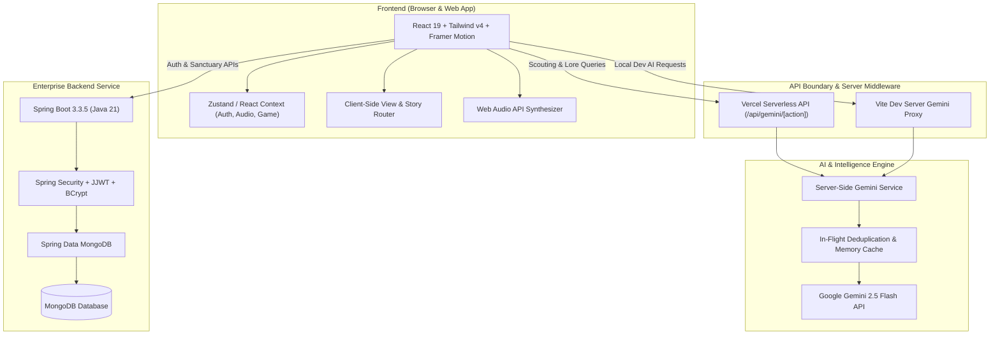
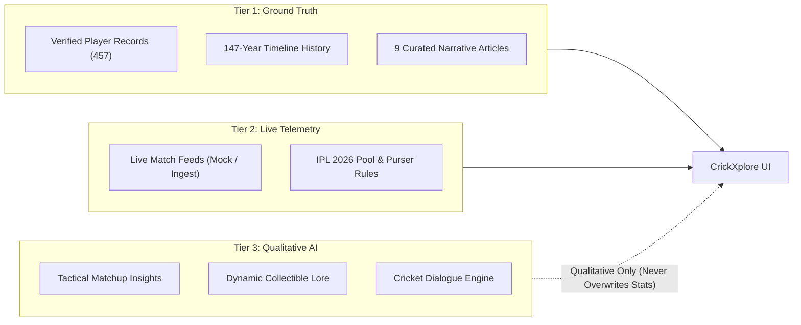

# CrickXplore

> *Explore the game beyond the scoreboard.*

CrickXplore is a cinematic, interactive cricket universe that brings the tactile beauty, strategic tension, and rich history of cricket to life. Moving beyond generic scoreboard tables, flat statistics, and SaaS dashboards, CrickXplore creates a digital sanctuary where fans, purists, and strategists can explore iconic eras, deconstruct legendary players, relive high-stakes moments, and engage with interactive digital collectibles.

Built with modern web technologies, spatial design principles, and procedural soundscapes, CrickXplore bridges the gap between historical reverence and forward-looking digital experiences. The platform combines a 147-year historical chronology, a curated 457-player catalog, an interactive stadium atlas, a deterministic tactical card game, long-form narrative storytelling, an IPL 2026 auction simulator foundation, and context-aware AI scouting intelligence powered by Google Gemini.

At its core, CrickXplore operates on a simple philosophy: **Scorecards tell you what happened. Stories tell you why it mattered.**

---

## 🏛️ 1. What is CrickXplore?

CrickXplore is an exploration-first cricket platform designed around four core pillars:

1. **Cinematic Spatial Storytelling**: Every match, era, and player is treated with museum-grade digital curation, utilizing ambient lighting, acoustic soundscapes, and physics-driven micro-interactions.
2. **Deterministic Collectibles & Game Engine**: A fully seeded, 457-card digital relic catalog paired with a client-side top-trumps strategy engine featuring pitch and weather modifiers.
3. **Curated & Provenance-Aware Data**: A tiered data architecture where verified historical statistics are strictly preserved and separated from real-time telemetry and qualitative AI scouting reports.
4. **Interactive Cricket Culture**: From high-stakes IPL auction dynamics to deep-dive retrospective essays on foundational moments in cricket history.

---

## 🗺️ 2. Experience Map

The table below outlines the current operational status of all major realms and subsystems across the CrickXplore universe:

| Realm / System | Experience Type | Primary Technology | Current Status |
| :--- | :--- | :--- | :--- |
| **Player Explorer** | The Pantheon (457 Players) | React 19 + TypeScript + Framer Motion | ✅ **Implemented** |
| **Timeline** | 147-Year Spatial Chronology (6 Eras) | React 19 + Framer Motion + Soundscapes | ✅ **Implemented** |
| **Moments Archive** | Living Memory & Tension Graphs | React 19 + GSAP + Audio Synthesis | ✅ **Implemented** |
| **Stadium Atlas** | The Colosseums (Pitch & Atmosphere) | React 19 + Dynamic Telemetry | ✅ **Implemented** |
| **Collectible Cards** | 457 Holographic Relics & Hero Overrides | CSS Shaders + Custom Foil System | ✅ **Implemented** |
| **Cricket Card Game** | 1v1 Tactical Clash Engine | Pure TypeScript Deterministic Engine | ✅ **Implemented** |
| **Cinematic Stories** | Long-Form Cricket Narratives | Markdown Engine + Dynamic Reading UI | ✅ **Implemented** |
| **IPL Auction Room** | 2026 Mega Auction Room Setup | React 19 + IPL 2026 Franchise Rules | 🟡 **Foundation / Partial** |
| **AI Cricket Intelligence** | Qualitative Scouting & Analysis Proxy | Google Gemini 2.5 Flash (`@google/genai`) | ✅ **Implemented** |
| **Authentication Service** | User Sanctuary & Profile Foundation | Spring Boot 3.3.5 + Java 21 + MongoDB | 🟡 **Foundation / Partial** |
| **Multiplayer / WebSockets** | Real-Time Live Auction & Card Battles | Spring WebSocket / STOMP | 🔮 **Planned** |

---

## ⚡ 3. Major Features Breakdown

### 🏏 Player Explorer (The Pantheon)
- **Comprehensive Catalog**: 457 curated international and domestic players spanning over five decades of cricket history.
- **Provenance-Aware Metrics**: Every metric tracks data source integrity (`LIVE`, `FALLBACK`, `ENRICHED`) to ensure historical reliability.
- **Multi-Era & Multi-Format Filtering**: Seamlessly filter by era (Golden Age, Modern Gladiators, T20 Revolution), format (Test, ODI, T20I, IPL), and role (Pure Bat, Express Pace, Mystery Spin, All-Rounder).
- **Radar Mastery Visualizations**: Granular breakdown of technique, mental composure, fielding agility, and pressure index.

### ⏳ Timeline Chronicles
- **147-Year Journey**: Interactive spatial timeline spanning from 1877 Timeless Tests to the modern franchise explosion.
- **6 Signature Eras**: Explore distinct epochs—Origins & Imperial Era, Post-War Resurgence, The Kerry Packer Revolution, Asian Ascendancy, The Golden 2000s, and the White-Ball / Franchise Era.
- **Era-Specific Audio & Visuals**: Dynamically adapted ambient soundscapes reflecting the technological and cultural shifts of each era.

### ⚡ Living Moments Archive
- **Tension & Decibel Reconstructions**: Relive immortal match situations (e.g., 2019 World Cup Final, Gabba 2021, 1983 Lord's Triumph).
- **Interactive Turning Points**: Ball-by-ball momentum shifts, win probability graphs, and key decision branch analysis.

### 🏟️ Stadium Atlas (The Colosseums)
- **Sacred Grounds**: Explore iconic venues from Lord's slope and the Melbourne Cricket Ground roar to Wankhede's humidity and Eden Gardens' cauldron.
- **Geology & Microclimate Telemetry**: Soil composition (black vs. red clay), boundary dimensions, dew factor indicators, and historical toss advantages.

### 🃏 Collectible Cards & Digital Relics
- **457 Deterministic Cards**: Auto-generated from the master player dataset with tiered rarities (`COMMON`, `UNCOMMON`, `RARE`, `EPIC`, `LEGENDARY`, `MYTHIC`).
- **10 Handcrafted Hero Cards**: Custom artwork, unique power attributes, and holographic foil overrides for iconic legends (e.g., Virat Kohli, Jasprit Bumrah, MS Dhoni, Sachin Tendulkar).
- **Physical Foil Rendering**: Multi-layered CSS lighting shaders simulating prismatic refraction, foil gleam, and tilt-reactive gyro physics.

### ⚔️ Tactical Card Clash (Card Game)
- **1v1 Deterministic Duels**: Fast-paced tactical card game pitting player attributes head-to-head (Batting Power, Bowling Skill, Clutch Rating, Captaincy).
- **Pitch & Condition Modifiers**: Green top, dustbowl, and flat track conditions introduce strategic multipliers to every duel.
- **Invalid-Stat Recovery**: Resilient fallback engine that gracefully handles missing or partial data without breaking game state.

### 📖 Cinematic Cricket Stories
- **9 Long-Form Narrative Articles**: Deep-dive storytelling exploring the socio-cultural, political, and emotional weight behind landmark cricket moments.
- **Curated Catalog**:
  1. *The Over That Birthed a Revolution* (Yuvraj Singh's six sixes in Durban, 2007)
  2. *The Ball That Broke the Century* (Shane Warne's Ball of the Century, 1993)
  3. *Tears in the Eden Dark* (The 1996 World Cup Semi-Final abandonment)
  4. *The Fortress Falls* (India's historic breach of the Gabba, 2021)
  5. *Eden Gardens, 2001: The Follow-On That Reordered Time* (Laxman & Dravid's 376-run stand)
  6. *The Barely-There Boundary* (The 2019 Lord's World Cup Final super over)
  7. *The Night Colombo Stood Still* (Aravinda de Silva and Sri Lanka's 1996 World Cup triumph)
  8. *Headingley Unbound: The Inning of Pure Will* (Ben Stokes' miracle in 2019)
  9. *The Lahore Miracle: When a Cornered Tiger Roared* (Imran Khan and Pakistan in 1992)
- **Editorial Architecture**: Dynamic reading time estimation, chapter navigation jumper, pull quotes, historical telemetry callouts, and curated author notes.

### 🔨 IPL 2026 Mega Auction Room (Foundation)
- **10 Official Franchises**: Complete franchise profiles with official primary/secondary colors and purse configurations.
- **Participant Setup**: Dynamic lobby configuration supporting 2 to 10 human/AI participant slots.
- **Player Pool Selection**: Configurable bidding pools (162 mapped 2026 auction pool players, marquee sets, accelerated sets).
- **Realtime Bidding Engine**: Local foundation ready for WebSocket-based live bidding integration.

### 🤖 Google Gemini AI Intelligence
- **Strict Numeric Preservation**: Deterministic barrier guaranteeing that verified historical statistics are never modified or hallucinated by LLM responses.
- **Qualitative Scouting & Comparison**: Contextual narrative scouting reports, head-to-head tactical matchups, and collectible card lore generation.
- **Dual-Layer Architecture**: Direct Vercel Serverless Function proxy (`/api/gemini/*`) with built-in Vite development middleware fallback, deduplication caching, and rate limiting.

### 🛡️ Authentication & User Sanctuary (Foundation)
- **Enterprise Spring Boot Service**: Production-grade Java 21 backend with Spring Security and Spring Data MongoDB.
- **Secure JWT Authentication**: Stateless bearer token verification with BCrypt password hashing.
- **Protected Endpoints**: User registration, login, profile retrieval (`/api/auth/register`, `/api/auth/login`, `/api/auth/me`), and CORS origin whitelisting.

---

## 🏗️ 4. System Architecture



---

## 🧠 5. Data & Intelligence Architecture

CrickXplore enforces a strict three-tier data hierarchy to balance historical accuracy with real-time responsiveness and generative AI storytelling:



### The SourcedValue Pattern
All critical player statistics utilize the `SourcedValue<T>` model to guarantee data provenance:
```typescript
interface SourcedValue<T> {
  value: T;
  source: 'LIVE' | 'FALLBACK' | 'ENRICHED';
  updatedAt: string;
  confidence?: number;
}
```

---

## 🃏 6. Collectible Card Architecture

The card generation subsystem converts raw player metrics into dynamic digital relics:

- **Seeded Determinism**: Card attributes, rarities, and power ratings are procedurally computed from career averages and milestones.
- **Rarity Distribution**:
  - `MYTHIC` / `LEGENDARY`: All-time greats with exceptional career longevity and clutch index.
  - `EPIC` / `RARE`: International captains, strike bowlers, and elite match-winners.
  - `UNCOMMON` / `COMMON`: Domestic stalwarts, emerging stars, and reliable squad players.
- **Hero Overrides**: 10 signature cards feature bespoke foil shaders, curated quotes, and custom visual art assets (`CX-LEG-VK-0018`, `CX-REC-JB-0093`, `CX-LEG-MSD-0007`, etc.).
- **Physical Shader Lighting**: Shaders calculate mouse/touch coordinates in real time to cast dynamic foil gleams and holographic rainbow refractions across card surfaces.

---

## 📖 7. Stories Architecture

The cricket storytelling engine provides a modular, extensible framework for publishing long-form narrative retrospectives:

- **Structured Schema**: Every story conforms to the `CricketStory` interface:
  - `slug`: URL-safe identifier for clean routing (`/stories/yuvraj-6-sixes-2007`).
  - `meta`: Reading time, era, publish date, author, and impact rating.
  - `sections`: Markdown-rendered narrative bodies paired with pull quotes, contextual sidebars, and historical data highlights.
  - `cinematicHero`: Visual header styling with ambient accent gradients and archival photography.
- **Dynamic Reading Experience**:
  - Sticky reading progress indicator tracking scroll depth.
  - Interactive table of contents jumping directly to narrative chapters.
  - Inline tactical callouts and historical scorecards.

---

## 🛠️ 8. Tech Stack

| Layer | Technology | Version | Purpose |
| :--- | :--- | :--- | :--- |
| **Frontend UI** | React | `^19.2.8` | Component architecture & modern concurrency |
| **Language** | TypeScript | `~6.0.2` | Full-stack type safety |
| **Build Tool** | Vite | `^8.3.0` | Ultra-fast HMR and optimized production bundles |
| **Styling** | Tailwind CSS | `^4.3.3` | Modern utility-first CSS design |
| **Motion** | Framer Motion | `^13.4.0` | Declarative spatial UI transitions & physics |
| **Animation** | GSAP | `^3.15.0` | High-performance timeline and scroll choreography |
| **Icons** | Lucide React | `^1.47.0` | Clean, lightweight icon suite |
| **AI SDK** | `@google/genai` | `^2.24.0` | Google Gemini 2.5 Flash client integration |
| **Backend Core** | Java | `21` (LTS) | Enterprise backend runtime |
| **Framework** | Spring Boot | `3.3.5` | Production-grade REST API and security foundation |
| **Security** | Spring Security + JJWT | `0.12.6` | Stateless JWT authentication & BCrypt password hashing |
| **Database** | MongoDB / Spring Data | `7.0+` | Scalable document storage for users and collections |
| **Linter** | Oxlint | `^1.81.0` | Blazing-fast Rust-based static analysis |
| **Script Runner** | `tsx` | `^4.19.0` | Native TypeScript script execution |

---

## 📁 9. Project Structure

```
CrickXplore/
├── .env.example                       # Template for environment variables
├── api/                               # Vercel Serverless Function routes
│   └── gemini/
│       └── [action].ts                # Gemini API serverless proxy
├── backend/                           # Spring Boot 3.3.5 Java Backend
│   ├── pom.xml                        # Maven configuration & dependencies
│   └── src/
│       ├── main/
│       │   ├── java/com/crickxplore/
│       │   │   ├── config/            # SecurityConfig, JwtTokenProvider, Filters
│       │   │   ├── controller/        # AuthController REST endpoints
│       │   │   ├── dto/               # Login, Register, Profile, API DTOs
│       │   │   ├── exception/         # Global exception handling & custom errors
│       │   │   ├── model/             # User entity and roles
│       │   │   ├── repository/        # Spring Data Mongo repositories
│       │   │   └── service/           # Auth service implementation
│       │   └── resources/
│       │       └── application.yml    # Spring configuration (dev/prod profiles)
│       └── test/                      # Backend unit & integration test suites
├── scripts/                           # Standalone validation and test suites
│   ├── test-auction-room.ts           # Auction room logic and pool tests
│   ├── test-card-catalog.ts           # 457-card catalog generator tests
│   ├── test-game-engine.ts            # Card game 1v1 battle engine tests
│   ├── test-gemini-architecture.ts    # Gemini proxy and cache validation
│   ├── test-gemini-player-stats.ts    # Statistical preservation verification
│   ├── test-stories-catalog.ts        # Stories catalog and schema tests
│   └── validate-players-dataset.ts    # 457-player dataset validation
├── server/                            # Local Node/Vite backend middleware
│   ├── plugins/
│   │   └── viteGeminiPlugin.ts        # Vite dev server middleware proxy
│   └── services/
│       └── gemini/                    # Gemini prompts, schemas, and client
├── src/
│   ├── api/                           # Client-side API fetchers
│   ├── assets/                        # Static assets, images, and audio
│   ├── components/                    # Reusable React components
│   │   ├── auction/                   # IPL auction room, lobby, and roster cards
│   │   ├── auth/                      # Sign-in, register, and profile modals
│   │   ├── cards/                     # Holographic card and foil rendering
│   │   ├── game/                      # Card game arena and duel layout
│   │   ├── moments/                   # Moment cards and tension graphs
│   │   ├── players/                   # Player cards, radar charts, and metrics
│   │   ├── stadiums/                  # Stadium atlas and pitch telemetry
│   │   ├── stories/                   # Story reader, progress bar, chapter menu
│   │   ├── timeline/                  # Spatial timeline and era selector
│   │   ├── Footer.tsx                 # Cinematic footer with realm navigation
│   │   └── Navbar.tsx                 # 3-zone responsive navigation bar
│   ├── context/                       # React Contexts (Auth, Audio, Theme)
│   ├── data/                          # Core data stores and catalogs
│   │   ├── auction/                   # IPL 2026 franchises and player pools
│   │   ├── cards/                     # Card definitions, hero overrides, catalog
│   │   ├── moments/                   # Iconic match moments archive
│   │   ├── players/                   # 457 player master dataset
│   │   ├── stadiums/                  # Stadium atlas dataset
│   │   ├── stories/                   # Curated long-form stories catalog
│   │   └── timeline/                  # 147-year timeline milestones
│   ├── game/                          # Deterministic card game logic
│   ├── hooks/                         # Custom React hooks
│   ├── pages/                         # Route page views (Landing, Stories, etc.)
│   ├── types/                         # TypeScript interface declarations
│   ├── utils/                         # Utility helpers and formatters
│   ├── App.tsx                        # Main application orchestrator
│   ├── index.css                      # Tailwind CSS root imports
│   └── main.tsx                       # React application root entrypoint
├── package.json                       # Frontend dependencies & scripts
├── tsconfig.json                      # TypeScript configuration
└── vite.config.ts                     # Vite build & plugin configuration
```

---

## 🔒 10. Security & Provenance Practices

1. **Zero Client-Side Secret Exposure**: The `GEMINI_API_KEY` is strictly accessed server-side via Vercel Serverless Functions or the Vite dev middleware. It is never exposed in client bundles.
2. **Deterministic Numeric Isolation**: Generative AI prompts are strictly constrained to qualitative analysis, tactical scouting, and lore generation. LLM outputs are never allowed to overwrite or alter verified career statistics.
3. **Enterprise Authentication**: User credentials and tokens are secured using industry-standard Spring Security practices:
   - Passwords hashed with BCrypt (strength 10+).
   - Stateless HMAC-SHA256 JWT tokens.
   - CORS origin validation enforcing strict domain boundaries.
4. **Resilient Error Boundaries**: Backend service unavailability gracefully falls back to local guest mode, ensuring uninterrupted browsing for all core realms.

---

## 🚀 11. Getting Started

### Prerequisites
- **Node.js**: v18.0.0 or higher
- **npm**: v9.0.0 or higher
- **Java**: Java 21 JDK (for backend service)
- **Maven**: v3.8+ (or use the included `./mvnw` wrapper)
- **MongoDB**: v6.0+ (optional, required for local backend user persistence)

### 1. Frontend Setup (Vite + React)

```bash
# 1. Clone repository
git clone https://github.com/aadesh-2006/CrickXplore.git
cd CrickXplore

# 2. Install frontend dependencies
npm install

# 3. Configure environment variables
# Copy .env.example to .env.local and add your GEMINI_API_KEY (optional for basic browsing)
cp .env.example .env.local

# 4. Start frontend development server
npm run dev
```

The frontend application will be available at `http://localhost:5173`.

### 2. Backend Setup (Spring Boot 3.3.5)

```bash
# Navigate to backend directory
cd backend

# Configure environment variables (or use defaults in application.yml)
# export MONGODB_URI="mongodb://localhost:27017/crickxplore"
# export JWT_SECRET="your-256-bit-secret-key"

# Run backend service with Maven wrapper
./mvnw spring-boot:run
```

The backend REST API will be available at `http://localhost:8080`.

---

## ⚙️ 12. Environment Variables

### Frontend & Serverless (`.env.local`)
| Variable | Required | Description |
| :--- | :--- | :--- |
| `GEMINI_API_KEY` | Optional | Google Gemini API key for AI scouting and narrative features. If omitted, AI features gracefully degrade to fallback mode. |
| `VITE_BACKEND_URL` | Optional | URL of the running Spring Boot backend (defaults to `http://localhost:8080` in development). |

### Backend Service (`application.yml` / Environment)
| Variable | Default (Dev Profile) | Description |
| :--- | :--- | :--- |
| `PORT` | `8080` | Port on which the Spring Boot application listens. |
| `MONGODB_URI` | `mongodb://localhost:27017/crickxplore` | MongoDB connection URI. |
| `JWT_SECRET` | `c2VjdXJlLWRldi1...` | Base64-encoded signing key for HMAC-SHA256 JWT tokens. |
| `JWT_EXPIRATION_MS` | `86400000` (24 Hours) | JWT token lifespan in milliseconds. |
| `CORS_ALLOWED_ORIGINS` | `http://localhost:5173,http://localhost:3000` | Allowed CORS origins for cross-domain requests. |

---

## 🧪 13. Testing & Validation Suite

CrickXplore includes comprehensive automated validation suites covering the frontend build, datasets, card engines, and game logic:

```bash
# 1. Verify frontend production build
npm run build

# 2. Run fast static analysis (Oxlint)
npm run lint

# 3. Validate the 457-player master dataset
npx tsx scripts/validate-players-dataset.ts

# 4. Validate the 457-card collectible catalog
npx tsx scripts/test-card-catalog.ts

# 5. Run deterministic card battle game engine tests
npx tsx scripts/test-game-engine.ts

# 6. Validate the IPL auction room configuration & player pool
npx tsx scripts/test-auction-room.ts

# 7. Validate the cinematic stories catalog and schema
npx tsx scripts/test-stories-catalog.ts

# 8. Test Gemini API architecture, caching, and statistic preservation
npx tsx scripts/test-gemini-architecture.ts
npx tsx scripts/test-gemini-player-stats.ts

# 9. Run backend unit & integration tests (Java / Spring Boot)
cd backend && ./mvnw test
```

---

## 🌐 14. Deployment & Operational Status

- **Frontend Deployment**: Configured for continuous deployment via [Vercel](https://vercel.com).
- **Serverless API Boundary**: The `/api/gemini/[action]` serverless handler enables secure, zero-config AI functionality in production on Vercel.
- **Backend Service**: Containerizable Spring Boot 3.3.5 service with production profiles (`prod`), ready for cloud hosting (Render, Railway, AWS ECS, GCP Cloud Run) with MongoDB Atlas integration.

---

## 🗺️ 15. Strategic Roadmap

### Phase 1: Foundation & Digital Museum (Completed ✅)
- [x] High-performance landing page with interactive 3D relic physics.
- [x] Procedural Web Audio stadium drone and acoustic willow soundscape.
- [x] 147-year spatial timeline covering 6 distinct eras.
- [x] Living Moments archive with match tension graphs.
- [x] Stadium Atlas with pitch geology and microclimate telemetry.

### Phase 2: Collectibles, Game Engine & Stories (Completed ✅)
- [x] 457-player curated international master dataset with provenance tracking.
- [x] Full deterministic 457-card digital collectible catalog with tiered rarities.
- [x] 10 signature hero card overrides with custom holographic foil shaders.
- [x] Deterministic 1v1 Top-Trumps-style local card duel game engine.
- [x] 9 curated long-form cinematic cricket stories with dynamic reading engine.
- [x] Google Gemini 2.5 Flash serverless proxy with strict numeric preservation.
- [x] Enterprise Spring Boot 3.3.5 authentication service foundation.

### Phase 3: Real-Time Multiplayer & Auction Simulator (In Progress 🟡)
- [ ] Live WebSocket/STOMP room infrastructure for real-time multiplayer card duels.
- [ ] Interactive live bidding clock and automated AI bidder bots for IPL 2026 Mega Auction.
- [ ] User deck builder, collection inventory persistence, and trading floor.
- [ ] Deployed production Spring Boot backend paired with MongoDB Atlas.

### Phase 4: Advanced Community & Spatial Features (Planned 🔮)
- [ ] User-authored cricket story submissions with editorial moderation.
- [ ] Global multiplayer tournaments and seasonal ranking ladders.
- [ ] Mobile PWA companion app with offline audio soundscape mode.

---

## 📜 16. Data, Content & Provenance Notes

- **Historical Statistics**: Player metrics, career records, and match outcomes are synthesized from historical cricket archives and structured for interactive exploration.
- **Story Content**: Long-form narrative retrospectives in the Stories realm are original editorial analyses honoring the cultural and emotional impact of historic cricket moments.
- **Art & Imagery**: Stadium layouts, relic cards, and visual compositions are custom UI assets designed specifically for the CrickXplore digital museum experience.

---

## 🤝 17. Contributing

We welcome contributions from cricket enthusiasts, designers, and developers!

1. Fork the repository (`git fork`).
2. Create your feature branch (`git checkout -b feature/new-realm-or-story`).
3. Ensure all validation suites pass (`npm run build && npx tsx scripts/test-stories-catalog.ts`).
4. Commit your changes (`git commit -m 'feat: add new feature'`).
5. Push to the branch (`git push origin feature/new-realm-or-story`).
6. Open a Pull Request.

---

## 📄 18. License & Intellectual Property

*Note: A formal open-source license is not currently specified for this repository.*

All cricket player names, team identities, match data, and franchise trademarks referenced within CrickXplore belong to their respective boards, governing bodies, and copyright holders (BCCI, ICC, IPL, CA, ECB, etc.). They are referenced under fair-use and educational principles for interactive historical and statistical analysis.
